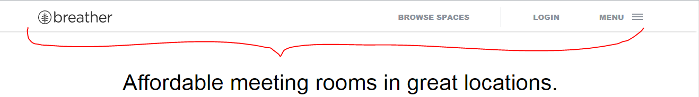
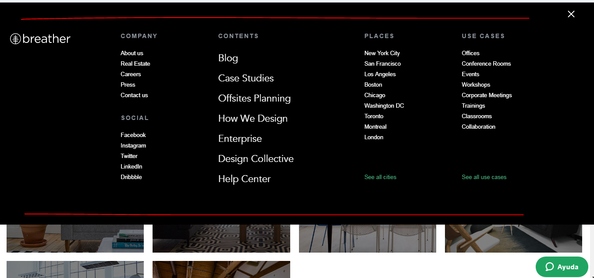
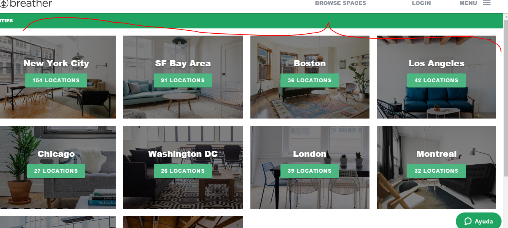
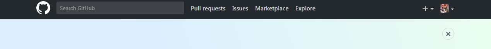
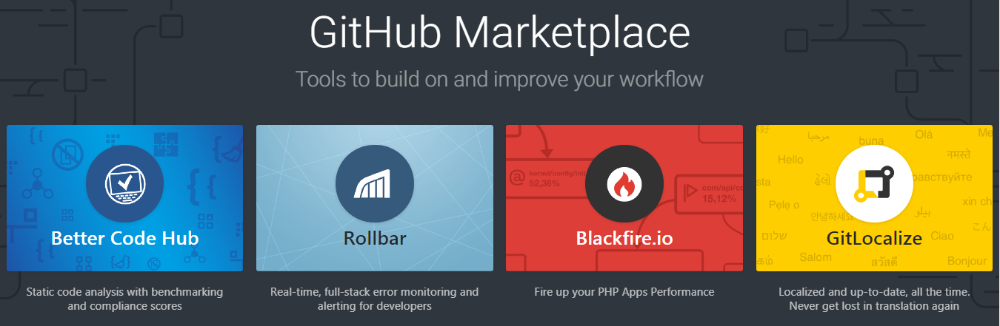
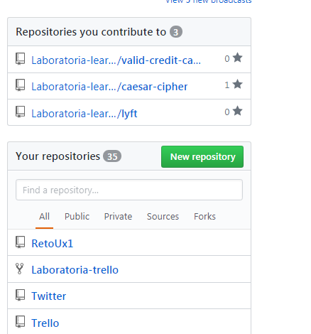
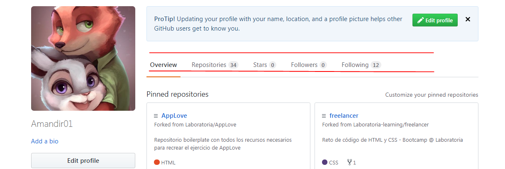
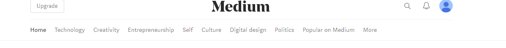
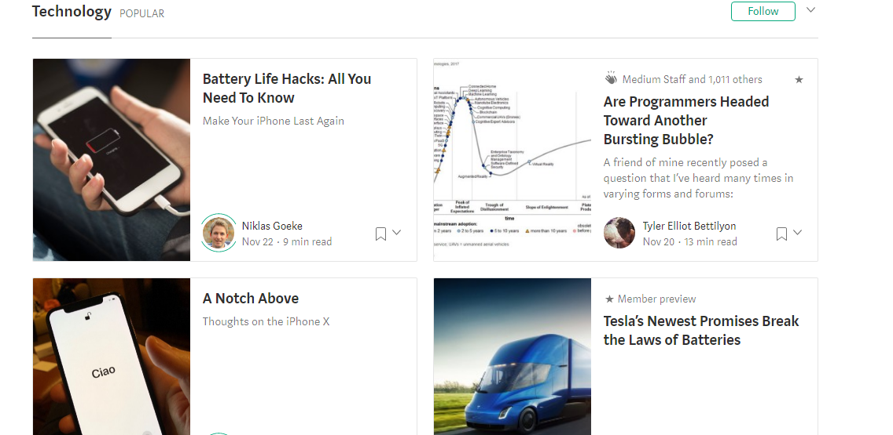
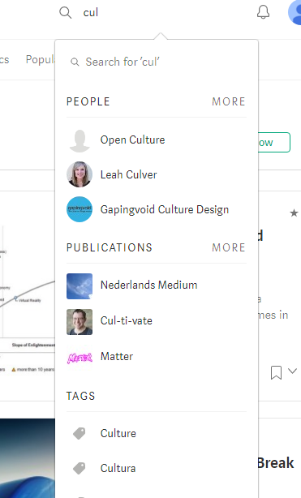

# Reto-Navegación
## Objetivo:

Identificar los elemento de navegación del site Breather,Github y Medium.

## Breather :
- Navegación global : Navegación principal y aparece en cada opción de la web.

- Navegación global : Nos ayuda a explorar todas las opciones del site.

- Navegación faceteada :  filtros no editables, definidos previamente por el sistema.

- Navegación Inline : Son links de referencia.

## Github :
- Navegación global :  Se repite en cada opción de la web.

- Navegación faceteada : Filtros que no son editables.

- Navegación faceteada : Filtros que no son editables.

- Navegación local : Página interna tiene su propia navegación .

- Navegación filtrada :  Una serie de opciones de filtros .

## Medium :
- Navegación global : Navegación principal del site.

- Navegación contextual : sugiere algunos articulos.

- Navegación Facetada : Buscamos algo , los resultados vienen ya previamente filtrados.

